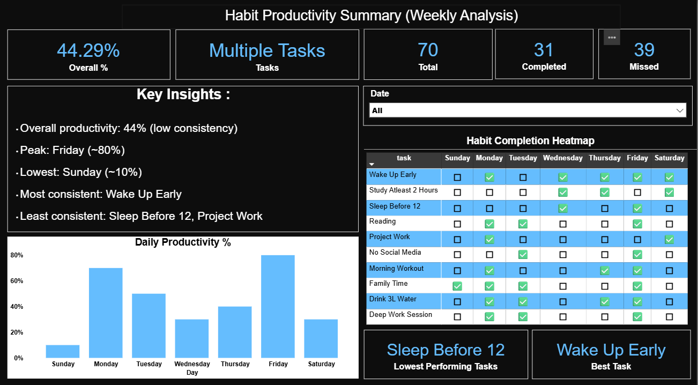
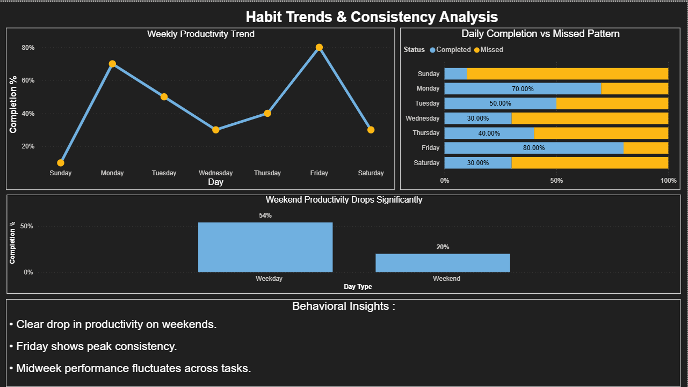

# Habit Productivity Dashboard (Power BI)

## 📊 Project Overview
This project analyzes daily habit completion data to identify productivity patterns and behavioral trends across a week.

## 🎯 Objective
To track habit consistency and identify high and low productivity periods.

## 🛠 Tools Used
- Python (Pandas, Matplotlib)
- MySQL (Data storage)
- Power BI (Dashboard visualization)

## 📁 Dataset
- 7 days of data
- 10 habits tracked daily
- Total ~70 records

## 🔍 Key Insights
- Overall productivity is around 44%, indicating low consistency
- Productivity peaks on Friday (~80%)
- Lowest performance observed on Sunday (~10%)
- Significant drop in productivity during weekends
- "Wake Up Early" is the most consistent habit
- "Sleep Before 12" and "Project Work" are least consistent

## 📈 Dashboard Preview

### Overview Page

### Analysis Page

## 🧠 Learnings
- Data cleaning and preprocessing using Python
- Handling data inconsistencies and duplicates
- Building interactive dashboards using Power BI
- Using DAX for calculated measures and insights

## 🚀 Conclusion
This dashboard helps identify patterns in habit consistency and provides insights to improve productivity.
